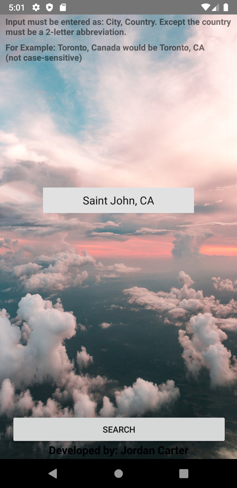
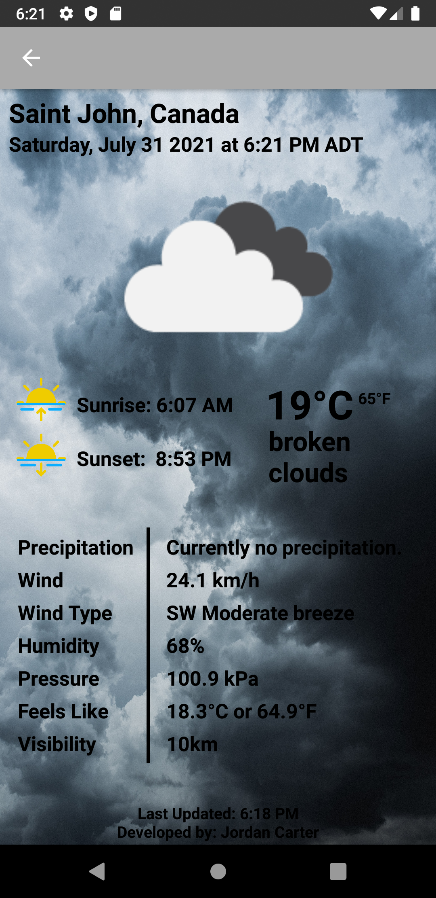
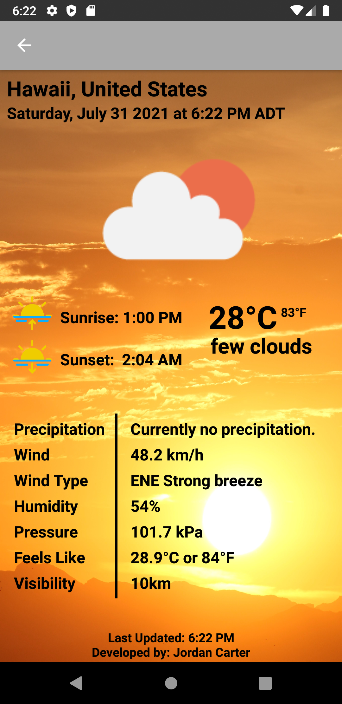
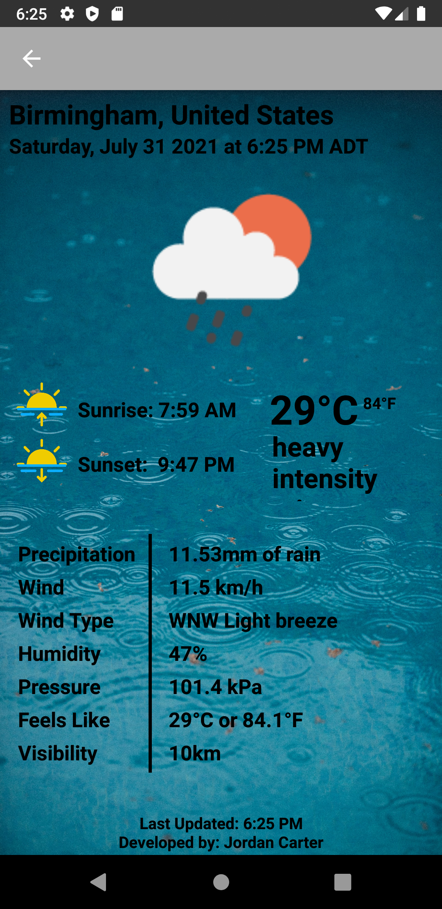

# Background Information
This weather application was a project I worked on in between my second and third year of my degree, the main focus behind it was to extend my JAVA skills by creating a mobile application (XML) that functioned by making calls to a backend API (JSON and XML Objects).

The entire project was built using Android Studio. For the frontend it was built using XML and the IDEs built in user-interface maker. The backend was built using JAVA and calls for the weather data was obtained by calling a Weather API (https://openweathermap.org/api) where data manipulation was required for displaying the XML data that was received.

To my knowledge the only way to run this project currently is through Android Studio due to their built in android emulator support, I assume this can be replicated in other softwares such as IntelliJ IDEA, Visual Studio, Eclipse, etc. It was tested on multiple android emulators but the main one used during development and testing was the Pixel 3a API28 as well as other Pixel variations.

Most of the files at the root were automatically generated / android studio files, the main files worked on were in "app/src/main", more specifically "app/src/main/java" for the JAVA and "app/src/main/res/layout" for the XML.

# Summary: Main Pipeline
## 1. Home Page

Users are greeted with the home page view (activity_main.xml) in the following figure, and are expected to enter an input in the correct format shown at the top of the screen. This is due to how the JSON in the API is set up, so entries must be "City, Country" where the country is a 2-letter abbreviation. All the countries are pre-defined in a JSON list given to us by the weather API, so when the user enters an input we perform validation checks on it to make sure it's in the list before we fetch the data for the entered input from the API. These checks mostly consist of making sure that the string is in the correct format explained above, if good procceed but if it's bad let the user know whats wrong. For correct inputs in the main button click event we can now scan the list to find the location ID for an exact match of the input. If the location id is found we can proceed by rendering the next activity aka the result page. All of these functions are handled by the 'MainActivity.java' file.

## 2. Result Page

  
  
  

This results page view (activity_weather2.xml) is shown in following figures above. Before the components are rendered the file 'WeatherActivity.java' will handle all of the fetching and some of the data maniplulation required. Depending on the input and weather data it will handle rendering the correct weather assets to the screen (such as the background images, data, time, etc as seen above). 

It starts this proccess by grabbing the information from the API as an XML string and parsing it into relevant components needed. Some reformatting/transforming of the data is required to get the specific units we are looking for, this is handled by calling the functions inside of my 'WeatherInfo.java'. This file will break apart the XML string for the specific function called and will reformat/convert it if needed. For the icons, another fetch call to the API grabs the neccessary weather icon for the locations current weather.

